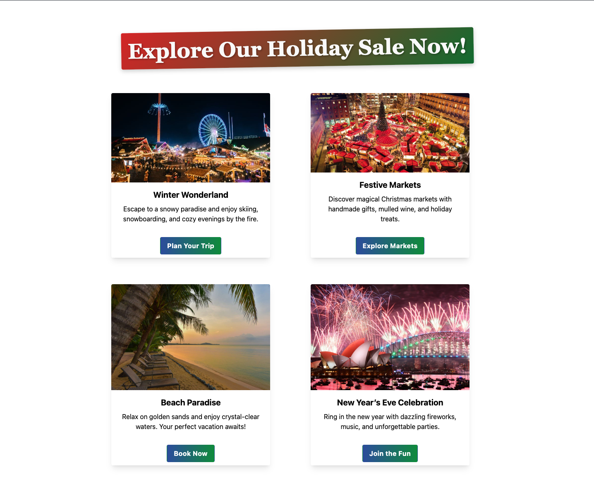

# ✈️ Travel Agency Cards

A simple and elegant **demo project** built with React and Tailwind CSS, showcasing travel destination cards in a responsive layout.

---

## 🌟 Features

- 🎨 Beautiful, responsive card design
- 🌍 6 curated travel destination cards
- 💡 Component-based structure using React
- 💨 Styled entirely with Tailwind CSS utility classes

---

## 🔧 Tech Stack

- React
- Tailwind CSS
- Vite

---

## 🚀 Getting Started

### 1. Clone the repository

```bash
git clone https://github.com/denichinv/tailwindCSS-travel-agency-cards.git
cd tailwindCSS-travel-agency-cards
```

### 2. Install dependencies

```bash
npm install
```

### 3. Start development server

```bash
npm run dev
```

---

## 📁 Project Structure

```
src/
├── components/
│   └── Card.jsx         # Reusable card component
├── App.jsx              # Renders all cards
├── index.css            # Tailwind base styles
├── main.jsx             # React entry point
└── App.css              # Additional custom styles (if any)
```

---

## 📸 Screenshot



